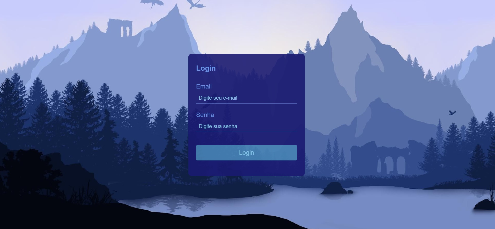

## 📌 Tela de Login e Validação com TS
Projeto de construção de uma tela de login com validação utilizado react-hook-forms, styled-components e typescript.

 

## 📎 Sumário
### ⭐ Features
### 📂 Temas abordados
### 🏆 Desafio
### 💻 Demonstração
### 🙋🏻‍♂️ Autor

 

## ⭐ Features
- Validar campos de e-mail e senha;
- UI Responsiva

 

## 📂 Temas abordados
- Criação de componentes no React
- useState
- Hook-forms
- Styled-components
- Funções JavaScript(ES6)
- Fundamentos do CSS
- Responsividade
- Pseudo-elementos

 

## 🏆 Desafio
Aplicar os conhecimentos aprendidos em react, utilizando a criação de componentes, utilização de useState, arrows functions em JavaScript, aplicação da biblioteca Styled-components do React e validação com a biblioteca hook-forms.

 

## 💻 **Demonstração**
Você pode acessar ao resultado final do projeto <a href="https://tela-login-ts.netlify.app/" target="_blank">Clicando aqui</a>.

 

## 🙋🏻‍♂️ Autor
Bruno Oliveira
